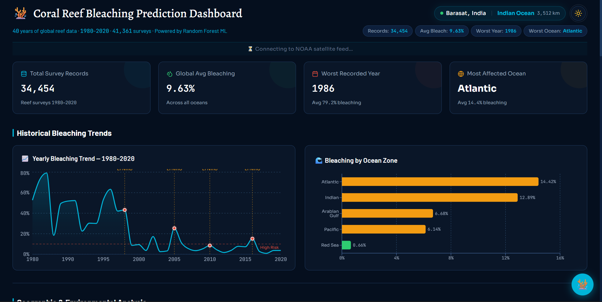
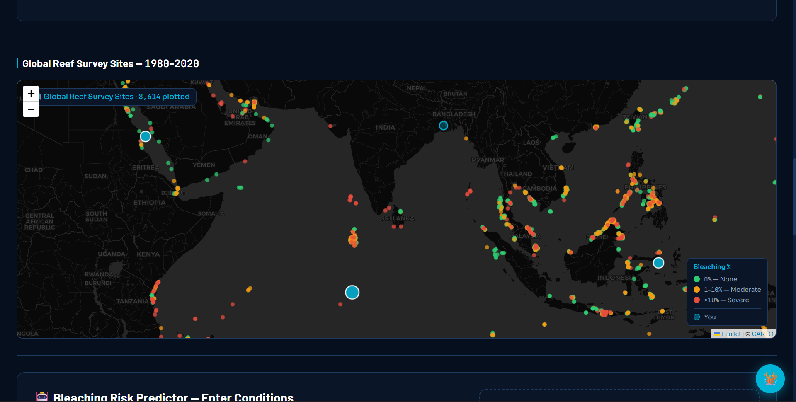
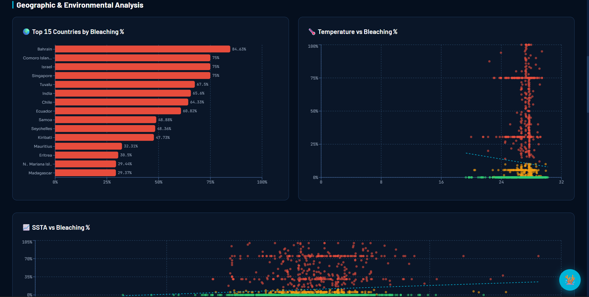
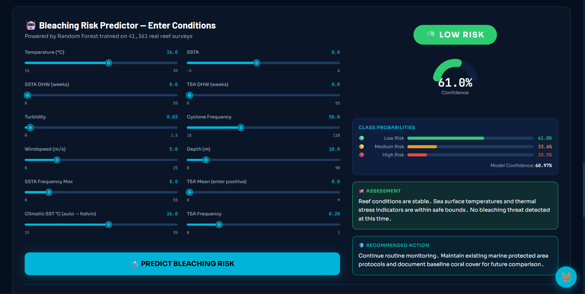
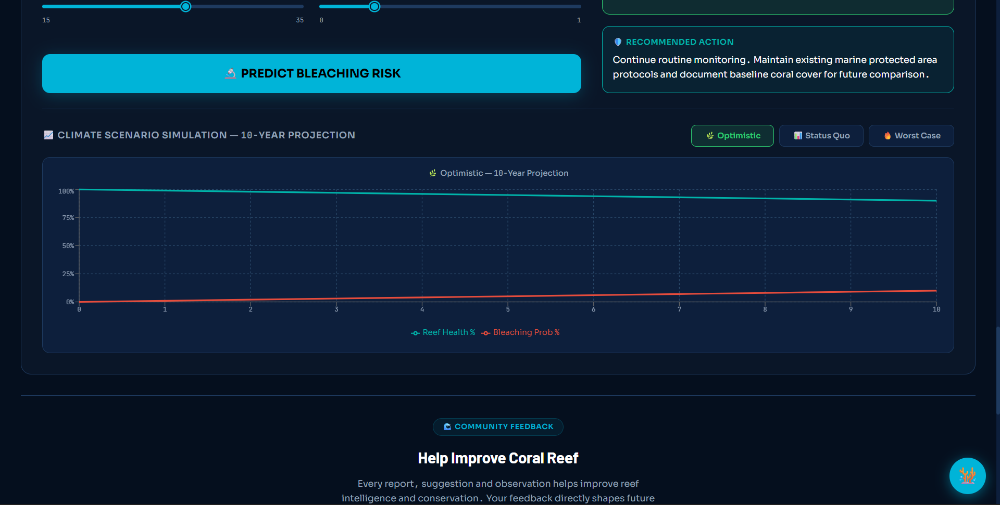
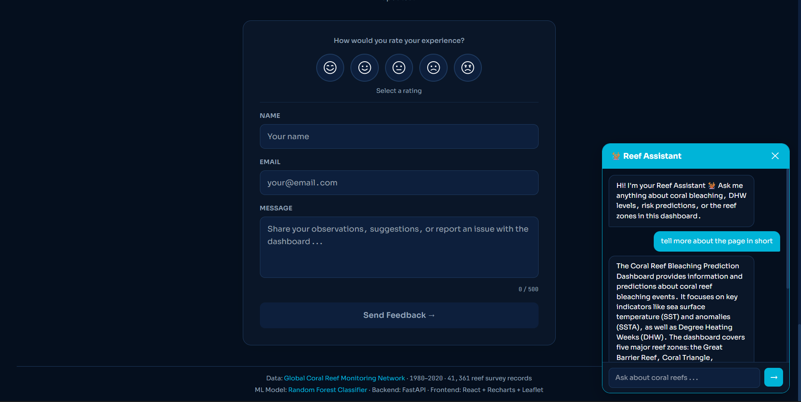
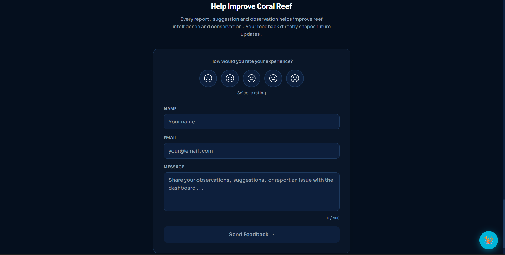

# 🪸 Coral Reef Bleaching Prediction Dashboard

An interactive full-stack dashboard for exploring historical coral reef bleaching data, monitoring live ocean conditions, and estimating bleaching risk using machine learning.

The project combines **historical environmental datasets**, **live NOAA satellite data**, **interactive visualizations**, and an **ML-powered prediction system** to make coral reef health data easier to explore and understand.

## ✨ Features

- 📊 **Interactive Data Visualizations** — Explore historical coral bleaching trends across years, countries, and ocean regions.
- 🗺️ **Interactive Reef Map** — Visualize coral reef observations and geographic patterns on a Leaflet-based map.
- 🛰️ **Live NOAA Data** — Monitor near-real-time ocean conditions for major reef regions.
- 🤖 **ML-Based Bleaching Risk Prediction** — Estimate bleaching risk using environmental variables.
- 🧪 **Scenario Simulation** — Adjust environmental conditions and observe predicted risk changes.
- 📍 **Location-Aware Experience** — Identify the nearest monitored reef zone.
- 💬 **AI Reef Assistant** — Ask coral reef and bleaching-related questions.
- 📝 **Feedback System** — Collect feedback through Supabase.
- 🌓 **Light & Dark Themes** — Responsive interface with theme support.

## 📸 Screenshots

### Dashboard



### Interactive Reef Map



### Data Visualizations



### Bleaching Risk Prediction



### Prediction Analysis



### AI Reef Assistant



### Feedback Section



> The screenshot links above use relative GitHub paths. Keep the images inside `public/screenshots/` with the same filenames, or update these paths to match your actual screenshot filenames.

## 🛠️ Tech Stack

### Frontend

- React 18
- Vite
- Tailwind CSS
- Recharts
- Leaflet
- React Leaflet
- Lucide React

### Backend

- Python
- FastAPI
- Uvicorn
- HTTPX

### Machine Learning

- Scikit-learn ecosystem
- Pre-trained coral bleaching prediction model
- Feature scaling and preprocessing

### Data & Services

- NOAA ERDDAP
- Historical Coral Reef Dataset
- Supabase
- OpenRouter API
- IP Geolocation APIs

### Deployment

- Vercel — Frontend
- Render — FastAPI Backend

## 🏗️ Project Architecture

```text
coral-reef-dashboard/
├── backend/
│   ├── model_files/
│   │   ├── coral_model.pkl
│   │   ├── features.pkl
│   │   └── scaler.pkl
│   ├── main.py
│   ├── model.py
│   ├── predict.py
│   ├── simulate.py
│   ├── test_predict.py
│   └── requirements.txt
├── data/
│   └── final_coral_reef_data.csv
├── public/
│   ├── data/
│   └── screenshots/
├── src/
│   ├── components/
│   ├── constants/
│   ├── hooks/
│   ├── lib/
│   ├── utils/
│   ├── App.jsx
│   ├── index.css
│   └── main.jsx
├── .env.example
├── package.json
├── render.yaml
├── tailwind.config.js
├── vercel.json
└── vite.config.js
```

## 🚀 Getting Started

### Prerequisites

- Node.js
- npm
- Python 3.11+
- pip

### 1. Clone the Repository

```bash
git clone <your-repository-url>
cd coral-reef-dashboard
```

### 2. Install Frontend Dependencies

```bash
npm install
```

### 3. Configure Environment Variables

Copy the example environment file:

```bash
cp .env.example .env
```

On Windows:

```bash
copy .env.example .env
```

Configure the required variables:

```env
VITE_OPENROUTER_API_KEY=your_openrouter_api_key
VITE_API_URL=http://localhost:8000
VITE_IPGEO_KEY=your_ipgeolocation_api_key
VITE_SUPABASE_URL=your_supabase_project_url
VITE_SUPABASE_ANON_KEY=your_supabase_anon_key
```

> Never commit your `.env` file or expose private/service-role credentials in the frontend.

### 4. Start the Frontend

```bash
npm run dev
```

The frontend will typically be available at `http://localhost:5173`.

## 🐍 Running the Backend

Navigate to the backend directory:

```bash
cd backend
```

Create a virtual environment:

```bash
python -m venv venv
```

Activate it on Windows:

```bash
venv\Scripts\activate
```

On macOS/Linux:

```bash
source venv/bin/activate
```

Install dependencies:

```bash
pip install -r requirements.txt
```

Start the FastAPI server:

```bash
uvicorn main:app --reload --port 8000
```

The API will be available at `http://localhost:8000`, with interactive documentation at `http://localhost:8000/docs`.

## 🧠 Bleaching Risk Prediction

The prediction system uses a trained machine-learning model to estimate coral bleaching risk from environmental conditions.

Users can adjust environmental parameters through the dashboard and submit them to the FastAPI backend. The backend preprocesses the inputs using the stored scaler and feature configuration before generating a risk prediction.

The dashboard presents the resulting risk category along with prediction probabilities and visual analysis.

> **Note:** Predictions are intended for educational and exploratory purposes. They should not be treated as a substitute for official scientific monitoring or professional environmental assessment.

## 🛰️ Live Ocean Monitoring

The backend retrieves ocean data from NOAA ERDDAP for selected coral reef regions.

Monitored parameters include:

- Sea Surface Temperature (SST)
- Sea Surface Temperature Anomaly (SSTA)
- Degree Heating Weeks (DHW)
- Bleaching Alert Area (BAA)

To reduce unnecessary external API requests, live data is cached temporarily by the backend.

## 📊 Historical Data Analysis

The dashboard uses historical coral reef data to visualize:

- Bleaching trends over time
- Ocean-wise bleaching statistics
- Country-level observations
- Temperature vs. bleaching relationships
- SST anomaly vs. bleaching relationships
- Geographic distribution of observations

## 💬 AI Reef Assistant

The built-in Reef Assistant provides contextual answers about coral bleaching, sea surface temperature, SST anomalies, Degree Heating Weeks, climate change, reef conservation, and dashboard predictions.

The assistant is intentionally scoped to coral reef and dashboard-related topics.

## ⚠️ Limitations

- Live environmental data depends on external NOAA service availability.
- Geolocation accuracy varies by provider.
- ML predictions depend on the quality and characteristics of the training data.
- Monitored reef zones represent broad geographic regions.
- AI-generated responses may contain inaccuracies.

## 🔒 Security Note

API keys and credentials should be stored using environment variables and must never be committed to the repository.

For production use, sensitive AI API calls should be proxied through a secure backend instead of exposing API credentials in client-side code.

## 🌍 Purpose

Coral reefs are highly sensitive to environmental stress, particularly prolonged increases in ocean temperature.

This project explores how modern web technologies, environmental datasets, live satellite observations, and machine learning can be combined into a single platform for visualizing and understanding coral bleaching risk.

The dashboard is primarily intended as an **educational, analytical, and demonstration project**.

## 👨‍💻 Author

**Suryadeep Banerjee**

Built as a project exploring full-stack development, environmental data visualization, API integration, and machine learning.

## 📄 License

This project is intended for educational and research purposes.

Please ensure that third-party datasets, APIs, and services are used in accordance with their respective licenses and terms of service.
Thank You
